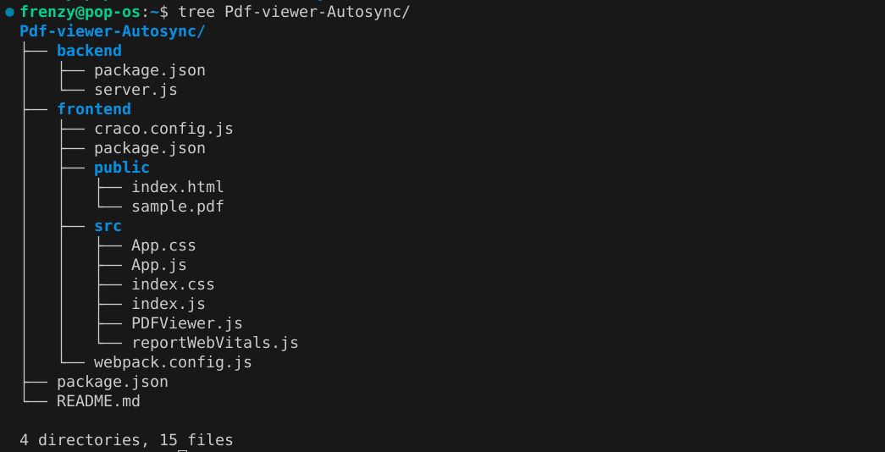

# PDF Viewer with Auto Sync

This project implements a PDF viewer that allows synchronization between two users (admin and regular viewer) through a socket connection. The admin can change the page, and the changes will be reflected on the viewer's side in real time.

## Features

- Real-time page synchronization between admin and viewers.
- Admin can change the page via the UI, and the change is reflected instantly on viewers' pages.
- Built using React (frontend), Express (backend), and Socket.io for real-time communication.

## Getting Started

To get started, you need to set up both the frontend and backend of the application.

### 1. Install Dependencies

1. **Install Dependencies for Backend**
   - Navigate to the backend folder and install the required dependencies.

cd backend
npm install

2. **Install Dependencies for Frontend**
- Navigate to the frontend folder and install the required dependencies.

cd frontend
npm install

### 2. Start the Application

- **Start the Frontend** (React App)
Navigate to the frontend folder and run:

npm start

This will start the React development server on `http://localhost:3000`.

- **Start the Backend** (Express + Socket.io)
Navigate to the backend folder and run:

npm run dev

This will start the Express server on `http://localhost:5000`.

### 3. Testing the Autosync Feature

- Open two different browser windows or tabs.
- **Admin Window**: Go to `http://localhost:3000/?isAdmin=true`.
- **Viewer Window**: Go to `http://localhost:3000/?isAdmin=false`.
- The admin can now change the page of the PDF in the admin window, and the changes will be reflected in the viewer window in real time.

### 4. Stop the Servers

- To stop the frontend server, press `Ctrl + C` in the frontend terminal.
- To stop the backend server, press `Ctrl + C` in the backend terminal.

## Technologies Used

### Frontend

- React
- React Hooks (`useState`, `useEffect`, etc.)
- Socket.io client (`socket.io-client`)
- PDF.js for rendering PDFs in the browser

### Backend

- Express.js
- Socket.io for real-time communication

## Folder Structure

